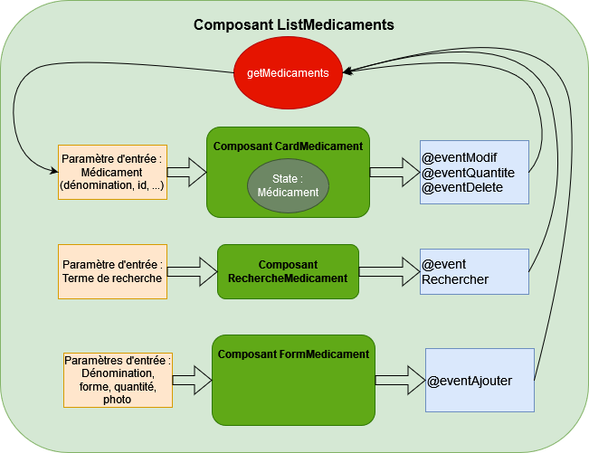

# Application pharmacie

Cette application simule le fonctionnement d'une pharmacie, permettant de visualiser, d'ajouter et de modifier des médicaments.

## Schéma explicatif 

## Fonctions demandées de la pharmacie

La pharmacie possède les fonctions CRUD classiques, c'est à dire : créer un médicament grâce au formulaire situé à droite de l'application, lire les médicaments présents sur l'API, modifier les informations d'un médicament ainsi que le supprimer. 
Il est également possible de rechercher un médicament grâce à la barre de recherche en haut de l'application, et d'incrémenter ou de décrémenter la quantité d'un médicament de un.

## Fonctions supplémentaires

Bien que l'application ne possède pas de fonction "botte secrète", plusieurs gardes fou permettent à l'application de prévenir les bugs :
- Il n'est pas possible d'ajouter ou de modifier un médicament ayant le même nom qu'un médicament préexistant. 
- Il n'est pas possible d'ajouter ou de modifier un médicament ayant une quantité supérieure ou égale à zéro. 
- Un médicament dont la quantité atteint zéro est supprimé.

### En espérant que la pharmacie vous plaira ! 